# OS chapter1 实验报告

***2017011998 冯卓尔 计86***

---

## 编程内容

我跟着实验指导书的叙述，复现了一遍移出std和main并实现命令行输出的简陋OS搭建。为了避免further bugs，我在rCore实验框架ch1分支的基础上继续进行修改实验。我在`Makefile`的cargo build之前为RUSTFLAGS传入LOG的参数，通过这个参数来设置当前OS输出log的level。另外，我在`consol.rs`中添加`trace`,`debug`,`info`,`warn`,`error`等宏，进行不同等级的颜色输出。

## 运行截图

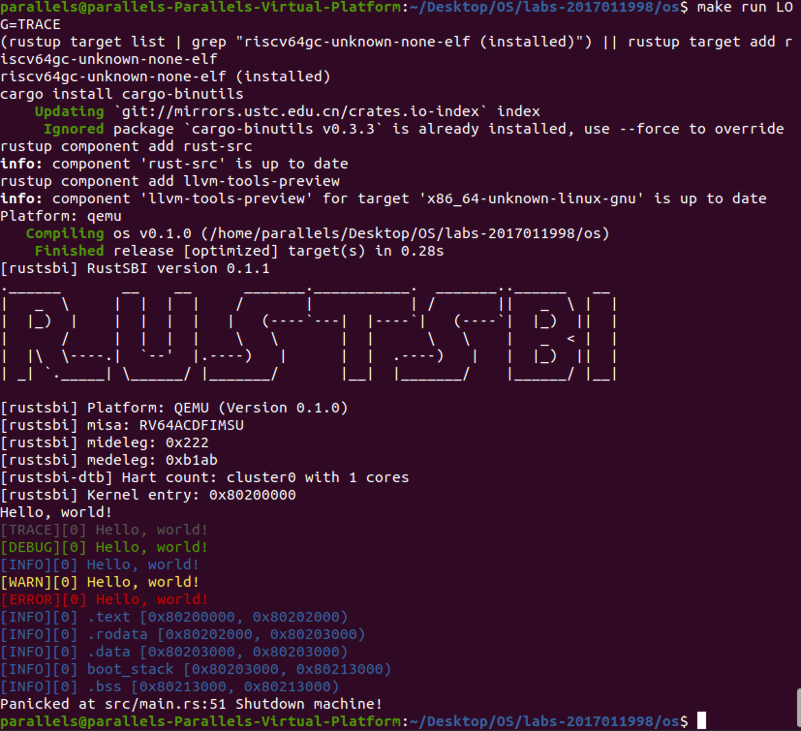

如图为输入trace等级以上的信息

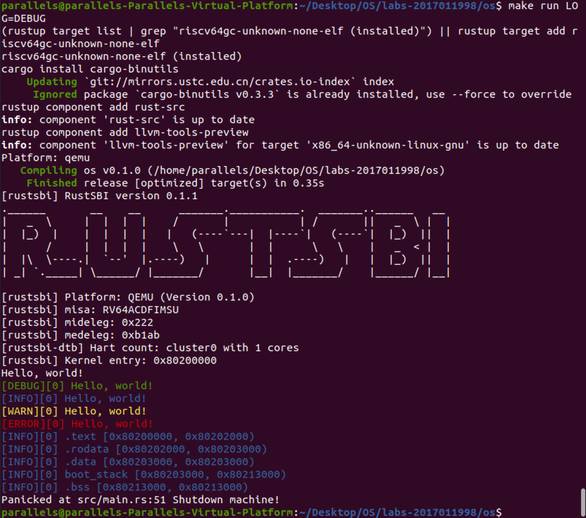

如图为输出debug以上等级的信息

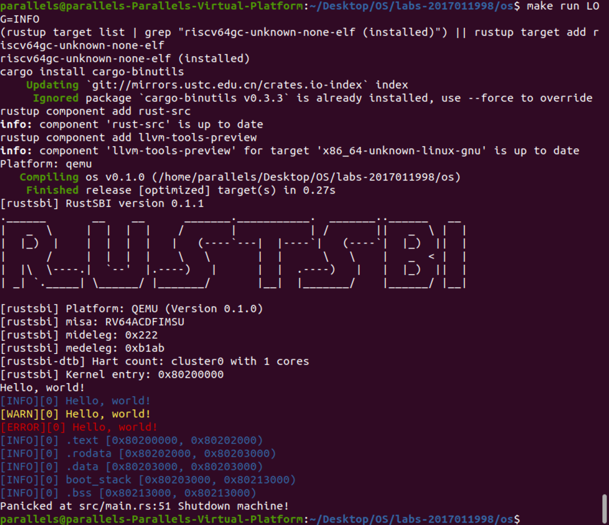

如果为输出info等级以上的信息

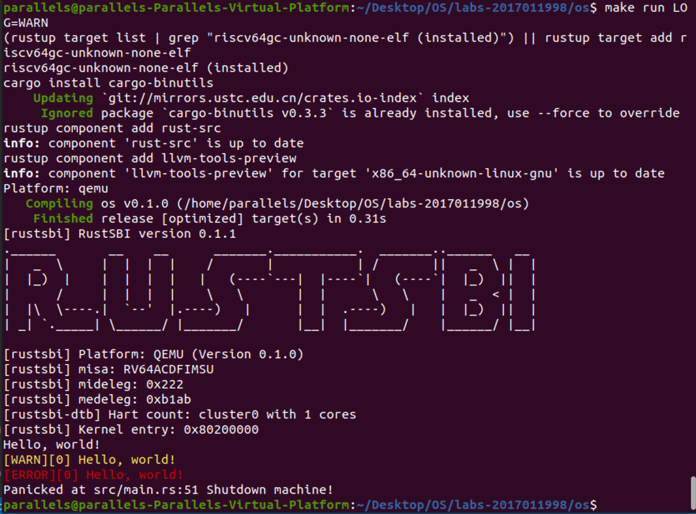

如图为输出warn以上等级的信息

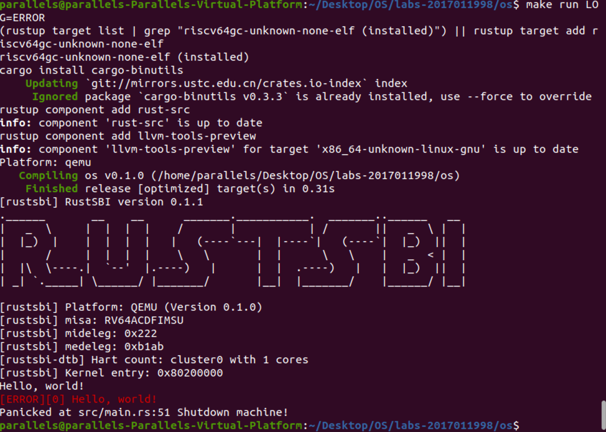

如图为输出error以上等级的信息

## 问答

1. 为了方便 os 处理，Ｍ态软件会将 S 态异常/中断委托给 S 态软件，请指出有哪些寄存器记录了委托信息，rustsbi 委托了哪些异常/中断？（也可以直接给出寄存器的值）

   ```
   riscv通过mideleg和medeleg进行委托，其中mideleg记录中断委托，而medeleg记录异常委托。
   rustSBI 委托了以下图的中断异常
   寄存器中的值是mideleg: 0x0222, 对应0000_0010_0010_0010，     medeleg: 0xb1ab 对应1011_0001_1010_1011
   ```

   Mideleg委托了以下的异常

   1 Supervisor software interrupt

   5 Supervisor timer interrupt

   9 Supervisor external interrupt

   Medeleg委托了

   0 Instruction address misaligned

   1 Instruction access fault

   3 Breakpoint

   5 Load access faul

   7 Store/AMO access fault

   8 Environment call from U-mode

   12 Instruction page fault

   13 Load page fault

   15 Store/AMO page fault

2. 请学习 gdb 调试工具的使用(这对后续调试很重要)，并通过 gdb 简单跟踪从机器加电到跳转到 0x80200000 的简单过程。只需要描述重要的跳转即可，只需要描述在 qemu 上的情况。

   

   我们约定CPU从逻辑地址0x1000启动。

   首先查看此处的之后的10条指令。

   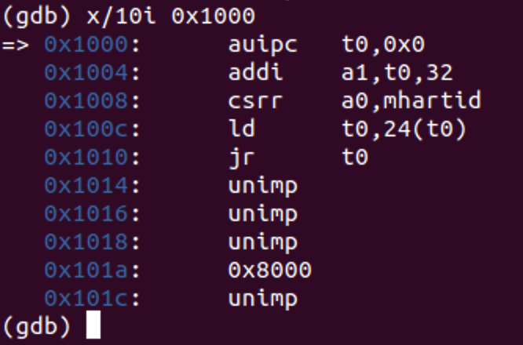

   可以计算出在0x1010时跳转至t0=0x8000_0000处。

   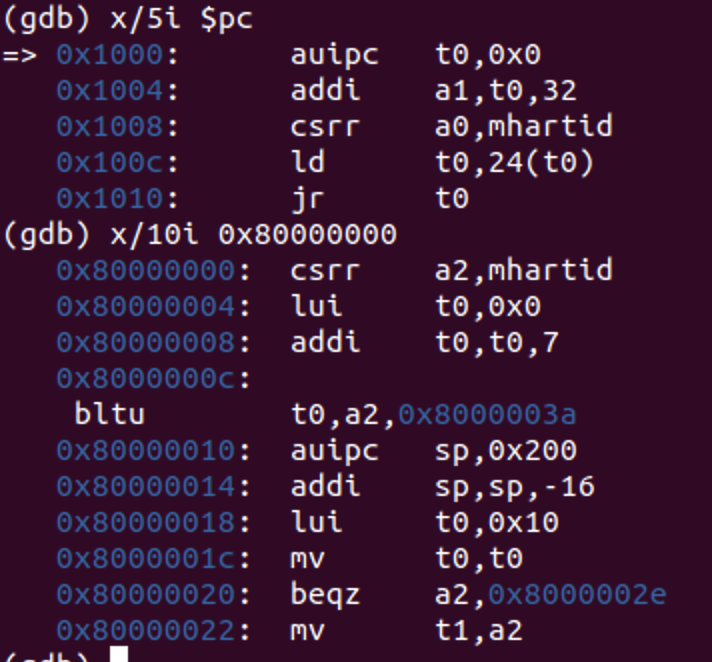

   执行后，接下来看0x8000_0000处的指令。对照rustRBI发现对应的是start()函数。由于GDB显示的是基础指令集，因此存在着一些等价转换。接着看原码，可以发现它最终会jump到`main`。不停执行它发现它会跳转到`0x0000_2572`，因而知道main的函数地址在`0x2572`。

   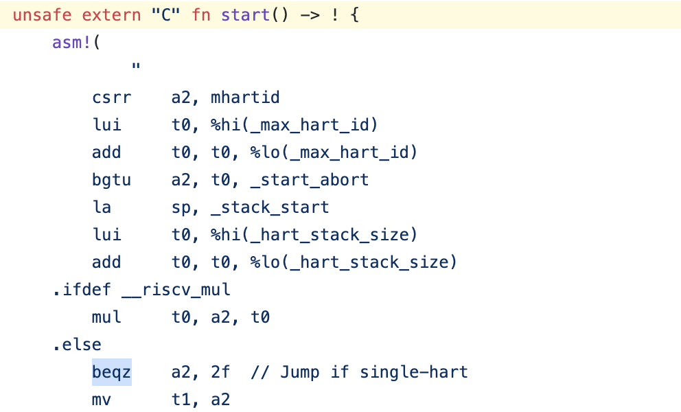

   

   接着阅读main()的代码，发现main结束于`enter_privileged()`函数，同时将`mepc`设置为`s_mode_start`的位置。

   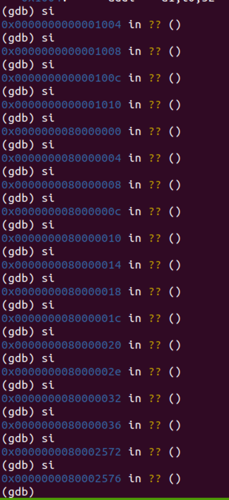

   这里我不知道s_mode_start的值，以及我也不知道`enter_privileged`的地址，因此先按部就班看下去。在原码中，`enter_privileged()`函数执行了`mret`指令，会从M态返回S态，也就是进入`s_mode_start()`的位置。为了知道这些地址，所以我直接将程序断点设置在OS的起始地址`0x8020_0000`,我们知道OS是个S态运行的程序，因此此时`mepc`还没来得及返回M态，所以此时存在`mpec`的值便是`s_mode_start()`的位置，发现是`0x800023da`。

   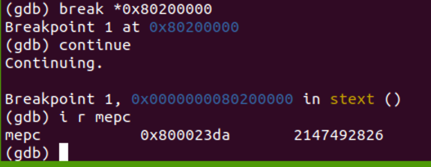

   此时为了知道`enter_privileged()`的地址，我只需查找进入`s_mode_start()`时的ra（因为还没返回），得到是`0x80002cd2`。

   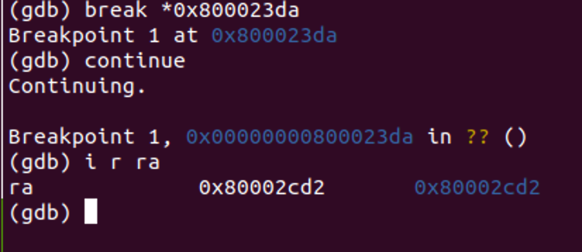

   这一条指令的上一条指令便是`j enter_privileged`，然后设置断点于`0x80002cce`，执行一条命令就知道`enter_privileged()`的位置了，是`0x80001504`。


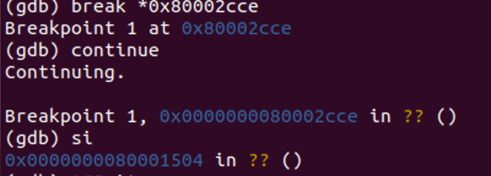

## 讨论

实验指导书确实很详细，实验代码也很详细。希望向老师能及时下课，以及老师讲课思路不清楚，可能是我教材看得少吧。