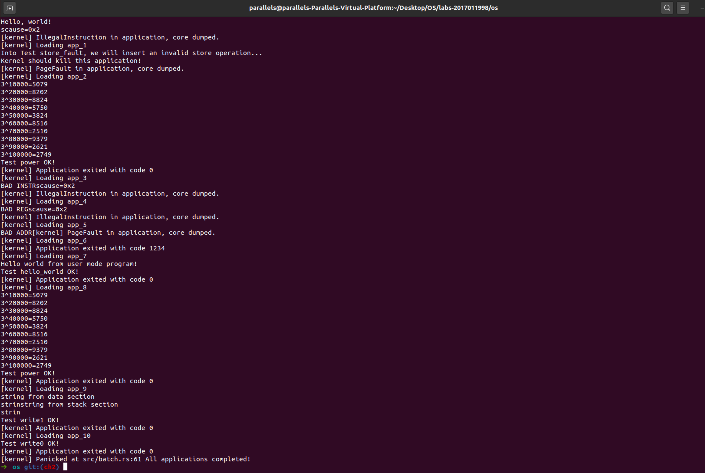
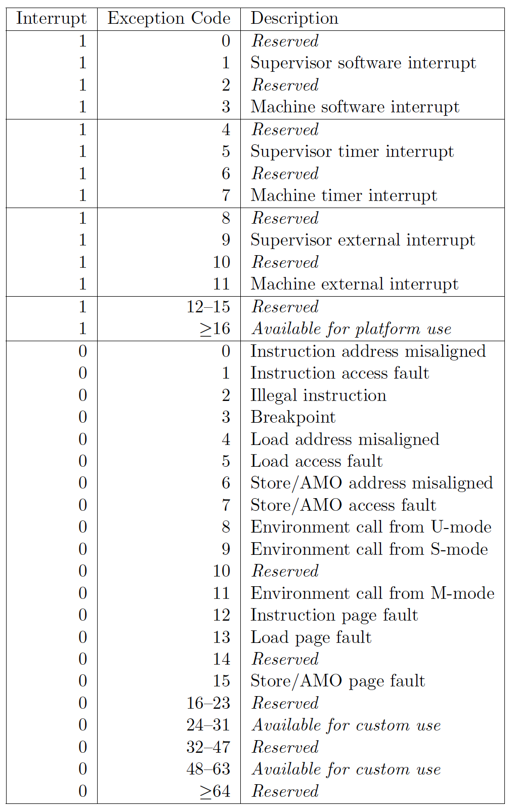

# OS chapter2 实验报告

***2017011998 冯卓尔 计86***

---

## 编程内容

我修改了三处，第一处是在`batch.rs`中提供内存地址合法性判断函数`pub fn in_valid_addr`，传入字符串起始地址和长度，返回布尔类型。第二处是在`mod.rs`的`TrapHander`函数中处理`sys_write`的时候额外传入`x2`寄存器的内容（当前用户栈的栈顶地址），这样就可以严格判断字符串是否合法（因为栈动态变化，并不是栈顶一下limit空间内的内容都是合法的）。最后在`fs.rs`的`sys_write`中调用该接口来判断合法性，如果为非法返回`-1`引发中断异常处理。

## 运行结果

## 问答

1. 正确进入 U 态后，程序的特征还应有：使用 S 态特权指令，访问 S 态寄存器后会报错。目前由于一些其他原因，这些问题不太好测试，请同学们可以自行测试这些内容（参考 [前三个测例](https://github.com/DeathWish5/rCore_tutorial_tests/tree/master/user/src/bin) )，描述程序出错行为，同时注意注明你使用的 sbi 及其版本。

   - 使用S态特权指令：`sret`指令运行后报错，`scause=0x2，[kernel] IllegalInstruction in application, core dumped.`是非法指令异常。
   - 访问S态寄存器：因为要访问S态寄存器只能通过S态特权指令，因而报错和上面是一样的，`scause=0x2
     [kernel] IllegalInstruction in application, core dumped.`是非法指令异常。
   - 访问非法地址（往0x0写入0）：访问了非法内存，`[kernel] PageFault in application, core dumped.`是缺页错误。

   我的`sbi`版本是`RustSBI version 0.2.0-alpha.1`。

   

2. 请结合用例理解 [trap.S](https://github.com/rcore-os/rCore-Tutorial-v3/blob/ch2/os/src/trap/trap.S) 中两个函数 `__alltraps` 和 `__restore` 的作用，并回答如下几个问题:

   1. L40: 刚进入 `__restore` 时，`a0` 代表了什么值。请指出 `__restore` 的两种使用情景。

      `__restore `是由`run_next_app`调用的，`a0`是函数传参寄存器，传入的参数是`KERNEL_STACK.push_context(TrapContext::app_init_context(APP_BASE_ADDRESS, USER_STACK.get_sp())`。简而言之，就是传入了当前的`sp`，这个`sp`的意义是正在运行的`TrapContext`程序的内核栈栈顶地址。

      `__restore`是恢复现场（返回U态）的作用，因而在`hander`处理完中断异常后会恢复此前用户寄存器的状态。另外还在加载程序的时候（进程切换，也是进入U态）使用。

   2. L46-L51: 这几行汇编代码特殊处理了哪些寄存器？这些寄存器的的值对于进入用户态有何意义？请分别解释。

      处理了`sstatus sepc sscratch`三个特殊寄存器，使用了`t0 t1 t2`为中间寄存器。

      `sstatus`记录了当前的状态，即硬件线程的状态。进入用户态时需要修改相应的指示S态和U态标志位，是否屏蔽中断等信息。

      `sepc`记录了返回用户态后，执行的第一条命令（即引发trap的后一条指令）

      `sscratch`记录了之后用户栈栈顶应当恢复为的地址。

   3. L53-L59: 为何跳过了 `x2` 和 `x4`？

      `sscratch`记录了原先的用户栈栈顶位置，`x2`约定是记录`sp`，在L63进行了恢复。

      `x4`约定是thread pointer，既不是caller也不是callee saved寄存器，因为用户程序并不会使用这个寄存器，所以不需要恢复。

   4. L63: 该指令之后，`sp` 和 `sscratch` 中的值分别有什么意义？

      `sp`为`sscratch`中的值，即发生中断异常前的用户栈顶值。

      `sscratch`：追踪`__restore`中对其的操作，可以发现在L63之前程序释放了`TrapContext`在内核栈上的空间，因而`sscratch`中的值为释放Trap后的内核栈栈顶地址。

   5. `__restore`：中发生状态切换在哪一条指令？为何该指令执行之后会进入用户态？

      `sret`从S态返回U态。这条指令配套的硬件操作是将用户态调整到U态（修改`sstatus`，并且将程序计数器指示的下一条指令修改为`sepc`的内容。

   6. L13： 该指令之后，`sp` 和 `sscratch` 中的值分别有什么意义？

      根据注释内容，执行之后`sp`为内核栈栈顶，`sscratch`为陷入`Trap`前的用户程序用户栈顶。

   7. 从 U 态进入 S 态是哪一条指令发生的？

      一般是U态程序通过`ecall`指令陷入到更高态的`Trap`处理句柄中，在本工程中，程序初始化的时候`init`函数使得在`write`的时候调用的`Trap`绑定在`alltraps`上。这条`ecall`应当由`rustsbi`帮忙生成的。

3. 程序陷入内核的原因有中断和异常（系统调用），请问 riscv64 支持哪些中断 / 异常？如何判断进入内核是由于中断还是异常？描述陷入内核时的几个重要寄存器及其值。

   支持很多种中断异常，请见下表。

   

   判断内核中断异常的种类是通过硬件判断的，硬件读取`sstatus`中的标志位，0代表异常，1代表中断、

   陷入内核时重要的寄存器有

   `sstatus`：Supervisor状态寄存器，记录硬件线程hart的处理状态，比如特权级，是否屏蔽中断等。（The mstatus register keeps track of and controls the hart’s current operating state）。

   `sscratch`：记录陷入前用户态用户栈栈顶地址

   `stval`：Supervisor bad address or instruction，即出现地址对齐、非法指令异常时，相应错误内容的寄存器

   `stvec`：记录陷入处理程序`TrapHander`的地址（BASE）以及向量模式（MODE）

   `sepc`：记录了引发发生中断异常的指令，在中断异常Trap处理后，跳回这条指令重新执行之。例外是`scall`指令，此时的`sepc`应该是这条指令的下一条指令地址。

   `scause`：记录发生中断异常的原因，具体内容可以查上表，与上表的区别是，缺少了Interrupt = 1, Exception Code = 3,7,11 的内容。

4. 对于任何中断， `__alltraps` 中都需要保存所有寄存器吗？你有没有想到一些加速 `__alltraps` 的方法？简单描述你的想法。

   不需要。有些中断用不到特定的寄存器。`x0`肯定不用保存，上面例子提到的`x4`保存硬件线程的信息，用户程序并不需要使用因而不需要保存。

   我想到的方法是直接对中断异常种类进行特判，即对于简单的中断异常处理用简单的处理程序做，对于复杂（例如请求外设、IO）的请求使用复杂的处理程序。

   

