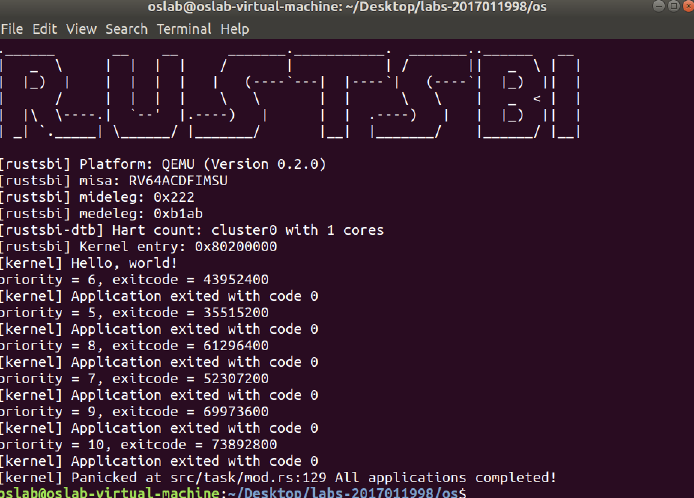

# OS chapter2 实验报告

***2017011998 冯卓尔 计86***


## 编程内容

我在 `TaskControlBlock` 定义中加入 `stride` 和 `priority` 两项，在 `config.rs` 的常数中加入 `BigStride`并设置为一个很大的数。然后在`mark_current_suspended` 中，将当前任务的 `stride` 加上 ` BigStride/priority`，在`find_next_task`中，使用一个O(n)的遍历寻找stride最小的任务作为下一个任务。

同时，增加`set_priotiry`的系统调用，用以set任务的优先级，同时增加了`task_start`用以记录任务总共执行的时间，超过一定的阈值就将其状态置位`EXIT`表示抛弃。

## 运行结果


可以看出进程成功地设置了优先级，并且输出了内容信息。


可以看出进程使用yield_实现了频繁的切换。



可以看exicode，它们与priority基本上呈正比关系，比例k约为7.3


图中的死循环被杀死，同时操作系统没有崩。

## 简答问题

1. **简要描述这一章的进程调度策略。何时进行进程切换？如何选择下一个运行的进程？如何处理新加入的进程？**

   采用了三种进程调度策略：协作式调度、抢占式调度和stride调度。

   协作式调度通过进程主动释放CPU进行切换，抢占式和stride调度通过CPU产生时钟中断进行切换或者程序主动释放；stride与抢占式相同。

   协作式调度与抢占式调度使用排队的方式选择下一个运行的进程，即在任务结束后扫描目前待执行的进程，遇到第一个就选择之；而stride调度对每个进程维护stride值，选择待执行进程中最小stride的进程执行之。

   协作式调度新加入进程加入后进入等待状态，待有进程释放CPU资源后进行竞争；抢占式调度与协作式调度类似；stride调度则将进入的新进程的优先级设置到最大，并且维护其stride初始化为0，进入等待执行的状态，随后，随着进程的执行更新其stride。

2. **在 C 版代码中，同样实现了类似 RR 的调度算法，但是由于没有 VecDeque 这样直接可用的数据结构（Rust很棒对不对），C 版代码的实现严格来讲存在一定问题。大致情况如下：C版代码使用一个进程池（也就是一个 struct proc 的数组）管理进程调度，当一个时间片用尽后，选择下一个进程逻辑在 [chapter３相关代码](https://github.com/DeathWish5/ucore-Tutorial/blob/ch3/kernel/proc.c#L60-L74) ，也就是当第 i 号进程结束后，会以 i -> max_num -> 0 -> i 的顺序遍历进程池，直到找到下一个就绪进程。C 版代码新进程在调度池中的位置选择见 [chapter5相关代码](https://github.com/DeathWish5/ucore-Tutorial/blob/ch5/kernel/proc.c#L90-L98) ，也就是从头到尾遍历进程池，找到第一个空位。**

**2-1. 在目前这一章（chapter3）两种调度策略有实质不同吗？考虑在一个完整的 os 中，随时可能有新进程产生，这两种策略是否实质相同？**

因为在中途并没有新的程序load进来，因而这两种策略实质是一样的。

在完整的OS中，C版会将进程插入数组头，rust版会将其将入队列，在选择下一进程的时候因判断方式不一样使得两种策略不一样。

**2-2. 其实 C 版调度策略在公平性上存在比较大的问题，请找到一个进程产生和结束的时间序列，使得在该调度算法下发生：先创建的进程后执行的现象。你需要给出类似下面例子的信息（有更详细的分析描述更好，但尽量精简）。同时指出该序列在你实现的 stride 调度算法下顺序是怎样的？**

| 时间点   | 0              | 1           | 2           | 3           | 4           | 5           | 6           | 7           |
| -------- | -------------- | ----------- | ----------- | ----------- | ----------- | ----------- | ----------- | ----------- |
| 运行进程 |                | p1          | p2          | p3          | P5          | p1          | p3          | P4          |
| 事件     | p1、p2、p3产生 |             | p2 结束     | p4 p5产生   | p5 结束     | p1 结束     | p3 结束     | p4 结束     |
| 数组     | p1 p2 p3 ()    | p1 p2 p3 () | p1 () p3 () | p1 p4 p3 p5 | p1 p4 p3 () | () p4 p3 () | () p4 () () | () () () () |

产生顺序：p1、p2、p3、p4、p5。第一次执行顺序: p1、p2、p3、p5、p4。违反公平性。

其他细节在表中的数组一行，追踪了`VecDeqeue`的信息。

| 时间点   | 0              | 1        | 2       | 3           | 4        | 5       | 6       | 7       |
| -------- | -------------- | -------- | ------- | ----------- | -------- | ------- | ------- | ------- |
| 运行进程 |                | p1       | p2      | p3          | P5       | p1      | p3      | P4      |
| 事件     | p1、p2、p3产生 |          | p2 结束 | p4 p5产生   | p5 结束  | p1 结束 | p3 结束 | p4 结束 |
| 优先队列 | p1 p2 p3       | p2 p3 p1 | p3 p1   | p4 p5 p1 p3 | p5 p1 p3 | p1 p3   | P3      |         |

在我们Rust中，所使用的天然是一个数组，我们假设是一个优先队列，并且假设p1 p3需要运行2个时间片才结束。

3. **stride 算法深入**

   **stride算法原理非常简单，但是有一个比较大的问题。例如两个 pass = 10 的进程，使用 8bit 无符号整形储存 stride， p1.stride = 255, p2.stride = 250，在 p2 执行一个时间片后，理论上下一次应该 p1 执行。**

   **3-1 实际情况是轮到 p1 执行吗？为什么？**

   ​	不是。因为`p2.stride = 10, p2.stride + p2.pass = u4 < p1.stride`，溢出，因此仍然是p2在执行

   **3-2 我们之前要求进程优先级 >= 2 其实就是为了解决这个问题。可以证明，在不考虑溢出的情况下, 在进程优先级全部 >= 2 的情况下，如果严格按照算法执行，那么 STRIDE_MAX – STRIDE_MIN <= BigStride / 2。**

   反证：假设Stride为时间片t的函数，并且在T时刻有`STRIDE_MAX – STRIDE_MIN > BigStride / 2`，不妨`p1.stride(T) - p2.stride(T) > BigStride`，那么刚刚的这个时间片执行的就是p1，否则`p2.stride(T-1) < p2.stride(T)`，可以令`T=T-1`直到刚刚执行的是`p1`。因此考虑时间片刚刚执行了p1。

   因为`priority >= 2`，那么有

   `pass = BIGStride / priority <= BigStride / 2 `。

   记上一进程p1，利用以上不等式

   `p1.stride（T-1) = p1.stride(T) - p1.pass > p2.stride(T) = p2.stride(T-1)`

   发现在T-1时刻产生了矛盾，此时`p2.stride(T-1) < p1.stride(T)`却执行了p1，因而假设不成立，命题正确。

   **3-3 补全如下 `partial_cmp` 函数（假设永远不会相等）。**

   ```rust
   use core::cmp::Ordering;
   
   struct Stride(u64);
   
   use config::BIG_STRIDE;
   
   impl PartialOrd for Stride {
   	fn partial_cmp(&self, other: &Self) -> Option<Ordering> {
   		let diff: u64;
   		if self.0 > other.0 {
   			diff = self.0 - other.0;
       } else {
   			diff = other.0 - self.0
   		}
   		if 2 * diff > BIG_STRIDE {
   			if self.0 > other.0 {
   				Some(Ordering::Less)
   			}	else {
   				Some(Ordering::Greater)
   			}
   		} else {
   			if self.0 > other.0 {
   				Some(Ordering::Greater)
   			}	else {
   				Some(Ordering::Less)
   			}
   		}
   	}
   }
   
   impl PartialEq for Person {
       fn eq(&self, other: &Self) -> bool {
           false
       }
   }
   ```

   例如使用 8 bits 存储 stride, BigStride = 255, 则:

   - (125 < 255) == false
   - (129 < 255) == true

