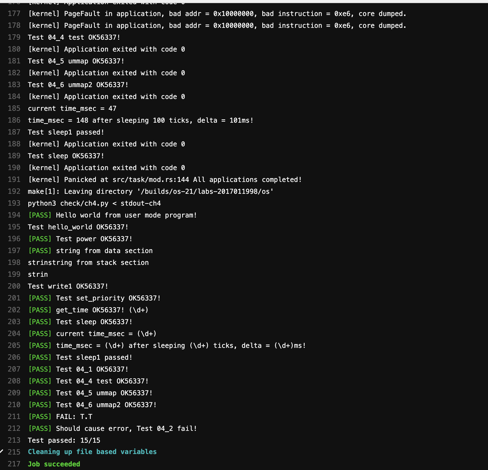

# OS chapter4 实验报告

***2017011998 冯卓尔***

## 编程内容

按照实验指导书和习题课的提示，我进行了

- 继承ch2，ch3的特性（实际上主要修改了`gettime()`，因为现在传指针都变成了虚拟地址）
- 在`task`中增加`insert_va()`和`remove_va()`函数，原因是每个进程都有自己的虚拟地址，某个进程申请虚拟地址应当不与目前自己的虚拟地址重复即可
- 其他的细节，如修改`MemorySet`，`MapArea`的接口，根据习题课所提的添加区间关系判断函数`check_relationship()`，一个坑点是`VPNRange()`是左闭右开的。

## 实验结果

通过了CI/CD的测试。

## 问答题

1. 请列举 SV39 页表页表项的组成，结合课堂内容，描述其中的标志位有何作用／潜在作用？

V[63:54] reserved

V[53:28] PPN 多级页表第1级物理页号

V[27:19] PPN 多级页表第2级物理页号

V[18:10] PPN 多级页表第3级物理页号

V[9:8] RSW available for OS use，硬件忽略

V[7] D 是否脏页，自从页表项上的这一位被清零之后，页表项的对应虚拟页表是否被修改过

V[6] A 是否被访问，自从页表项上的这一位被清零之后，页表项的对应虚拟页面是否被访问过；

V[5] G 全局（目前无需关注）

V[4] U 用户态是否可访问

V[3] X 是否可执行

V[2] W 是否可写

V[1] R 是否可读

V[0] V 是否有效

2. 缺页

   > 这次的实验没有涉及到缺页有点遗憾，主要是缺页难以测试，而且更多的是一种优化，不符合这次实验的核心理念，所以这里补两道小题。
   >
   > 缺页指的是进程访问页面时页面不在页表中或在页表中无效的现象，此时 MMU 将会返回一个中断，告知 os 进程内存访问出了问题。os 选择填补页表并重新执行异常指令或者杀死进程。
   >
   > - 请问哪些异常可能是缺页导致的？
   > - 发生缺页时，描述相关的重要寄存器的值（lab2中描述过的可以简单点）。
   >
   > 缺页有两个常见的原因，其一是 Lazy 策略，也就是直到内存页面被访问才实际进行页表操作。比如，一个程序被执行时，进程的代码段理论上需要从磁盘加载到内存。但是 os 并不会马上这样做，而是会保存 .text 段在磁盘的位置信息，在这些代码第一次被执行时才完成从磁盘的加载操作。
   >
   > - 这样做有哪些好处？
   >
   > 此外 COW(Copy On Write) 也是常见的容易导致缺页的 Lazy 策略，这个之后再说。其实，我们的 mmap 也可以采取 Lazy 策略，比如：一个用户进程先后申请了 10G 的内存空间，然后用了其中 1M 就直接退出了。按照现在的做法，我们显然亏大了，进行了很多没有意义的页表操作。
   >
   > - 请问处理 10G 连续的内存页面，需要操作的页表实际大致占用多少内存(给出数量级即可)？
   > - 请简单思考如何才能在现有框架基础上实现 Lazy 策略，缺页时又如何处理？描述合理即可，不需要考虑实现。
   >
   > 缺页的另一个常见原因是 swap 策略，也就是内存页面可能被换到磁盘上了，导致对应页面失效。
   >
   > - 此时页面失效如何表现在页表项(PTE)上？

   **2-1** 根据RV32手册，以下三种异常可以由缺页引发：Instruction page fault，Load page fault，Store/AMO page fault

   **2-2**

   `satp`：控制分页，[63:60]控制开启分页、使用的分页系统，后44位为对应查询到的的PPN（初始为一级页表的入口地址），[59:43]为ASID。

    `scause`：记录异常的种类，此时为缺页异常，根据具体种类可能有3种情况

   `stvec`：记录陷入处理缺页异常程序`TrapHander`的地址（BASE）以及向量模式（MODE）

   `sepc`：记录发生异常的指令地址

   `sscratch`：记录陷入前用户态用户栈栈顶虚拟地址

   `stval`：此内容与缺页异常无关

   `sstatus`：记录当前硬件线程状态、是否屏蔽中断等

   **2-3** 首先，页表实际上会占用大量的内存空间，Lazy策略能够有效减少非必须的页表开销，节省空间。另外，lazy的做法在读写的时候还能降低相应的写代价，特别是多核时的脏页记录，减少缓冲区的开支。

   **2-4** 因为使用了三级页表，一个页的大小为4096B，考虑到数量级，三级页表的数量是最多的，所以数量级大致为10G/4KiB * 8 = 20M。

   **2-5** 根据习题课讲的思路，可以这样实现：在一开始并不将真正的数据如.text段的信息加入页表，而是用户程序使用入B-Tree的高级数据结构进行暂存，当真正的缺页发生时，首先查询用户程序保存的数据结构，如果是一个非法地址访问或者类似的非法访问，就可以直接报错；如果是一个合法的访问，则将结果返回，并且将数据结构中被查询到的键值对更新到页表中去，也就是完成一次页表的更新。

   **2-6** 因为物理地址发生了变化，因此将V位置设置成invalid即可，即页表项已经失效。

3. 双页表与单页表

   为了防范侧信道攻击，我们的 os 使用了双页表。但是传统的设计一直是单页表的，也就是说，用户线程和对应的内核线程共用同一张页表，只不过内核对应的地址只允许在内核态访问。(备注：这里的单/双的说法仅为自创的通俗说法，并无这个名词概念，详情见 [KPTI](https://en.wikipedia.org/wiki/Kernel_page-table_isolation) )

   - 如何更换页表？
   - 单页表情况下，如何控制用户态无法访问内核页面？（tips:看看上一题最后一问）
   - 单页表有何优势？（回答合理即可）
   - 双页表实现下，何时需要更换页表？假设你写一个单页表操作系统，你会选择何时更换页表（回答合理即可）？

   **3-1** 在我们的实验中（双页表），页表不是硬件实现更换的，而是软件的Trap处理函数来更换页表。在双页表的情况下，刚刚发生缺页异常的时候，OS刚刚从U态进入S态，此时的进程页表用的还是用户的页表，此时需要`__alltrap`的`switch`函数将用户的页表换成内核态的表。另外也需要清空所有的TLB（因为需要使原先的缓存都失效，不能毒害正常的数据访问）

   **3-2** 页表项增加访问控制位，例如S态及以上可访问、U态及以上可访问（即依赖于U位进行控制）；同时增加进程id等数据来形成用户程序间的隔离。

   **3-3** 存储空间小，内核态访问用户态内存更加轻松，使得系统的内存结构，紧凑、便于调度。在发生中断异常的时候，就不用频繁更新页表了，特别是使用了TLB的情况下，每次切换都需要清空TLB，这种设计在一次完成的缺页处理中会发生两次也表的切换（U->S->U）。

   **3-4** 双页表实现下，每次中断异常、切换进程都需要切换页表。单页表一般而言我会选择Lazy方法，因为用户和内核共用一个页表，因而在发生进程切换、中断异常的时候都不一定需要换表，换表只在pagefault的情况下换，其他情况下，通过用户进程id、MODE等标识符进行内存隔离。

