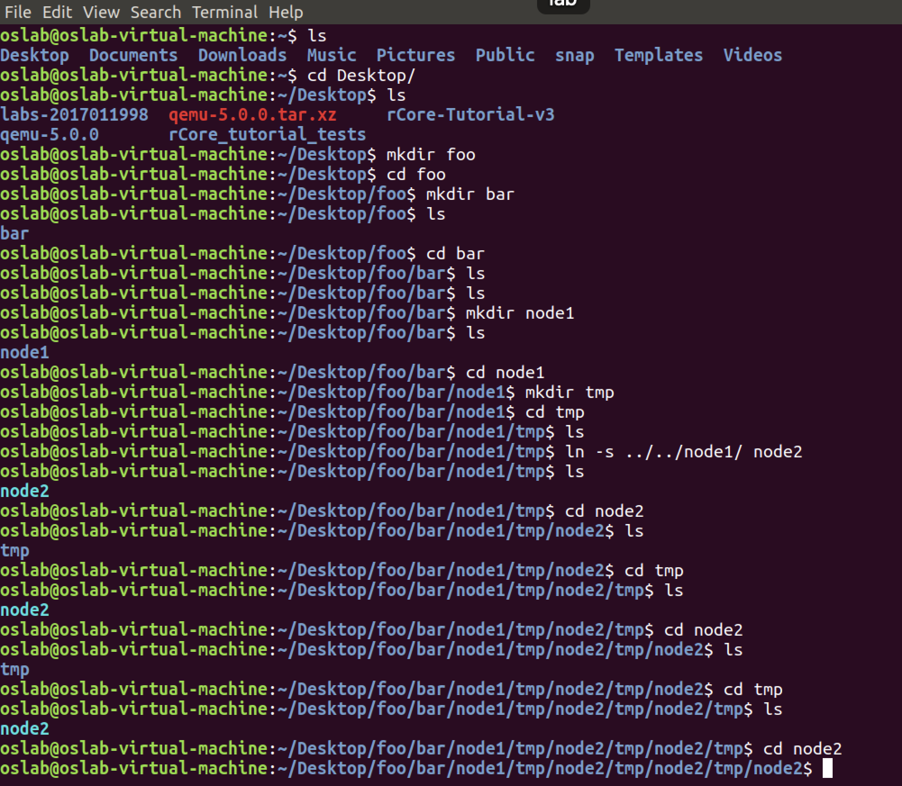

# OS chapter7 实验报告

***2017011998 冯卓尔 计86***

---

### 实验内容

- 使用git合并参考实现ch7分支与上期代码
- 为`Inode`类添加`inode_id`用以记录其在分配时的id，于`vfs.rs`中
- 为`File` trait添加`get_stat`接口，计算并返回该`file`所记录的stat，所有实现了该trait的类相应实现了，实际上只有`OSInode`需要实现返回Stat的功能，于`fs/inode.rs, fs/mod.rs`等文件中
- 为`syscall`添加三种调用，于`syscall/mod.rs, syscall/fs.rs`中

### 实验结果

通过测例和CI/CD

### 思考题

1. 目前的文件系统只有单级目录，假设想要支持多级文件目录，请描述你设想的实现方式，描述合理即可。

   首先，因为多级目录，实现的硬链接`dirfd`就不是定值`AT_FDCWD (-100)`了，而是需要具体的文件描述符；在实现过程中，目前只有`fstat`使用fd来推算inode的inode_id，修改后 `linkat`和`unlinkat`两个调用都需要计算inode_id，同时`ls`等系统调用也需要`fd`来获得inode_id，用以获得该inode的全部信息，而不是将其简单地视作文件类型。

2. 在有了多级目录之后，我们就也可以为一个目录增加硬链接了。在这种情况下，文件树中是否可能出现环路(软硬链接都可以，鼓励多尝试)？你认为应该如何解决？请在你喜欢的系统上实现一个环路，描述你的实现方式以及系统提示、实际测试结果。

   可以实现环路（但是软的）。我通过软连接实现了一个环路，如下图。文件树中，`node1-tmp-node2(node1)`形成了环路。

   

   可以发现Linux系统禁用硬链接目录，原因其实很有道理：硬链接相当于对目录所在节点提供另一个文件名，那么这样的话就对目录下的内容进行了一次复制，由于硬链接就有可能有环路存在，在复制过程中会死循环，因此禁止硬链接，允许软连接（快捷方式）。“你认为应该如何解决”问题的答案就是禁止硬链接。（参考https://www.zhihu.com/question/50223526）

